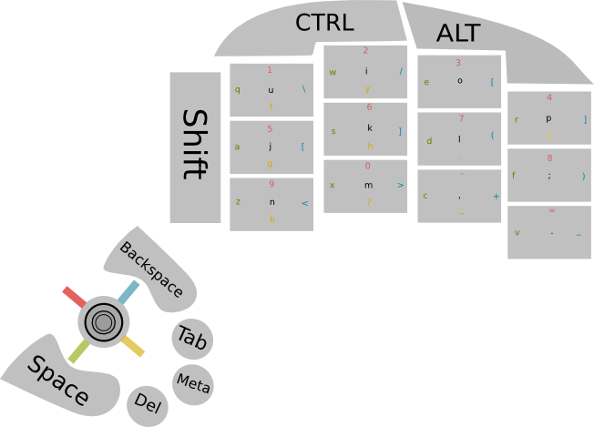

Keyboard
========

Microcontroller code for a one handed keyboard.

The aim is to help people suffering from carpel tunnel or any other issues which might 
prevent them from using a hand, while simultaneously preserving a keyboard layout
which they might already be accustomed to.

Design
------

The general design works around the idea that fingers should move only in vertical tracks whenever possible,
leaving the thumb to do most of the lateral movement. In this case, it ends up being the
thumb that changes the virtual key space that the physical keys represent. In the diagram below
we're using a 5-way switch to select the slice of the keyspace we're currently using.

To give you an idea of what the layout is intended to look like using a QWERTY-ish layout,
see this diagram: 

Hardware
--------

So far, it's just been breadboarding. 

Here's a photo of the prototype hardware so far:

